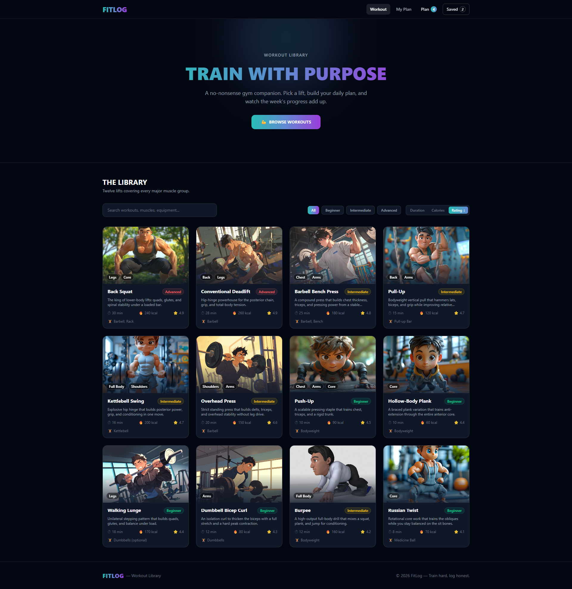
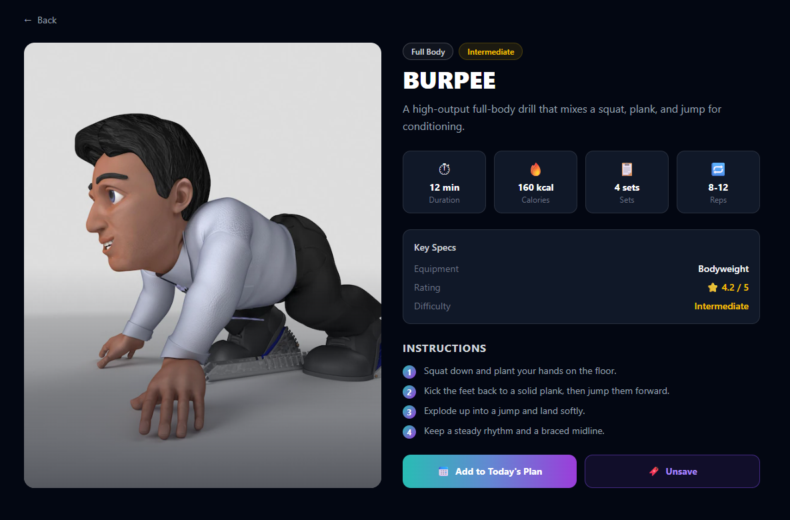
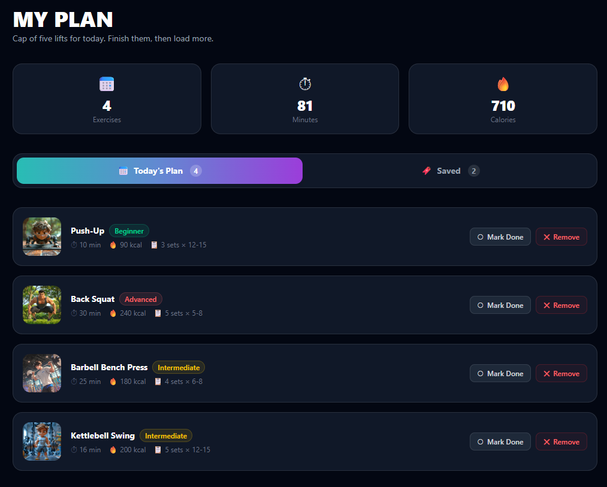
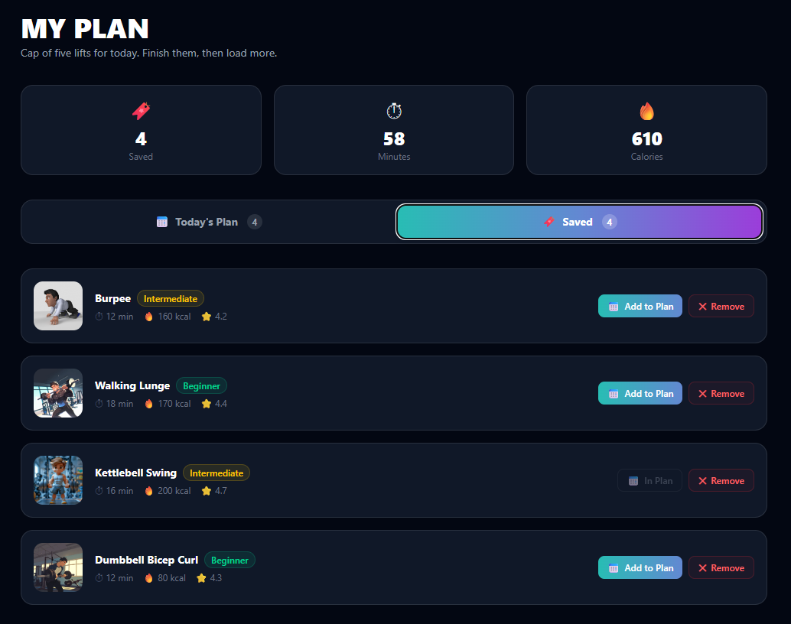
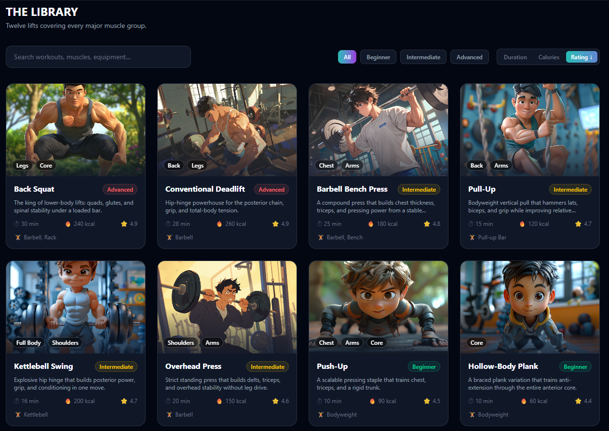
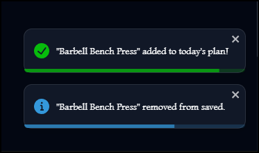

# 🏋️ FitLog — Workout Library

**Browse workouts, build your daily plan, and track progress — fast.**

A sleek **React + TypeScript** workout library that pulls exercises from a **live REST API**,
lets you **plan today’s workouts**, **save favorites**, and keeps everything persisted via **localStorage**.

🔗 [**Live Demo**](https://fitlog-workout-library-mu.vercel.app/) &nbsp;•&nbsp; 📦 [**Repository**](https://github.com/Avijit-Datta/FitLog-WorkoutLibrary)

---

## 📖 About the Project

**FitLog** is a workout library app that lets users **browse gym exercises**, **filter/search/sort**
the list, and add workouts into **Today’s Plan** with a live counter in the navbar.

Users can also **save workouts for later**, open a **full workout detail page** (instructions + key stats),
and track progress by **marking workouts as done**. All selections persist using **localStorage**
(so they survive refresh).

Data is loaded from a **live REST API**:

- All workouts: `https://api.api-store.workers.dev/api/fitlog`
- Single workout: `https://api.api-store.workers.dev/api/fitlog/:id`

---

## 🖼️ Screenshots

<table>
  <tr>
    <td align="center" width="33%">
      <strong>Workout Library (Home)</strong> 
      
    </td>
    <td align="center" width="33%">
      <strong>Workout Details</strong> 
      
    </td>
    <td align="center" width="33%">
      <strong>Today’s Plan</strong> 
      
    </td>
  </tr>
  <tr>
    <td align="center" width="33%">
      <strong>Saved Workouts</strong> 
      
    </td>
    <td align="center" width="33%">
      <strong>Search • Filter • Sort</strong> 
      
    </td>
    <td align="center" width="33%">
      <strong>Toastify notification</strong> 
      
    </td>
  </tr>
</table>

---

## 🛠️ Technology Used

- ⚛️ **React 19** + **TypeScript** — UI + type safety
- ⚡ **Vite** — build tool + dev server
- 🎨 **Tailwind CSS v4** — styling
- 🧭 **React Router DOM v6** — routing
- 🔔 **React Toastify** — toast notifications
- 💾 **localStorage** — persistent client-side state

---

## ✨ Features

1. **🌐 Live REST API workouts**
   Browse workouts fetched from a real API endpoint (not hardcoded data).

2. **🔎 Powerful discovery tools**
   **Filter** by difficulty (Beginner / Intermediate / Advanced), **search** by name / muscle group / equipment,
   and **sort** by duration, calories, or rating.

3. **🗓️ Today’s Plan + progress tracking**
   Add workouts to **Today’s Plan**, see a live navbar counter, and **mark workouts as done**.

4. **⭐ Save for later**
   Keep a separate **Saved** list for workouts you want to revisit.

5. **📊 Live totals by tab**
   On **My Plan**, minutes + calories totals update dynamically depending on the active tab.

6. **📄 Full workout detail pages + 404**
   Dedicated workout pages with instructions + stats, plus a friendly **404** route for unknown paths.

7. **💾 Persistent state**
   Your plan + saved list survive refresh using **localStorage**.

---

## 🔗 Links

- **GitHub Repository:** https://github.com/Avijit-Datta/FitLog-WorkoutLibrary  
- **Live Site:** https://fitlog-workout-library-mu.vercel.app/ 

---